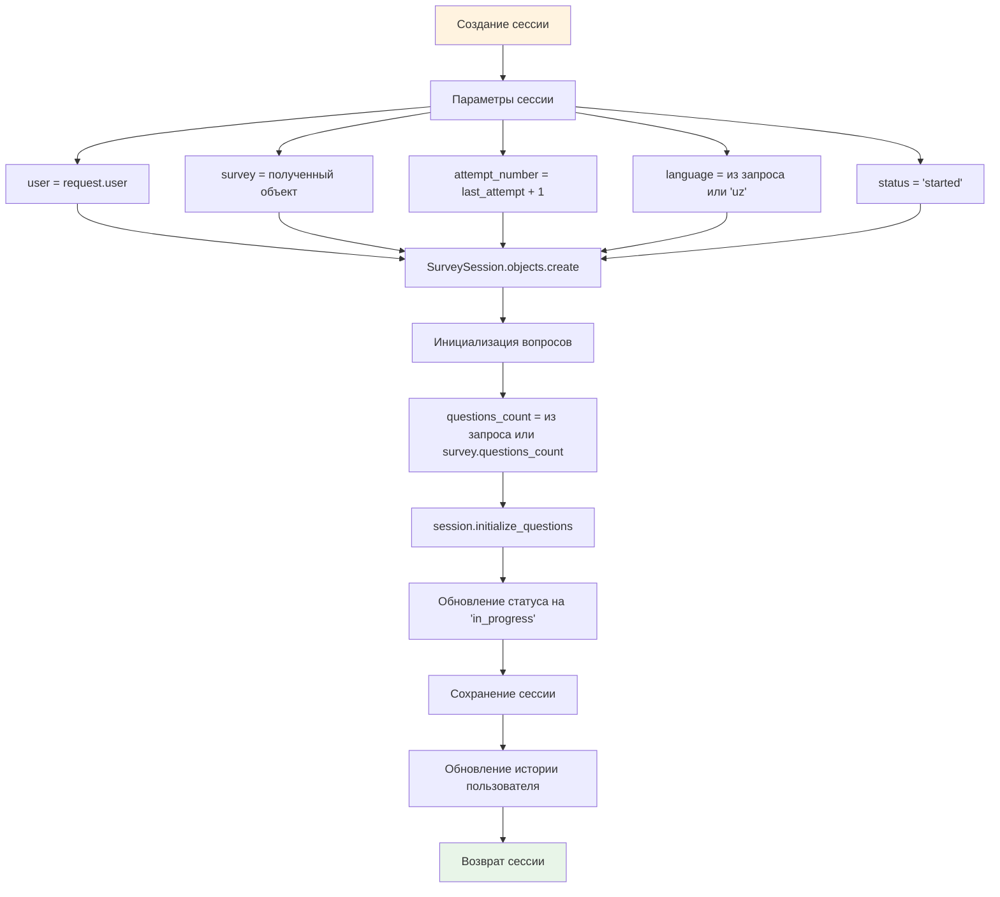
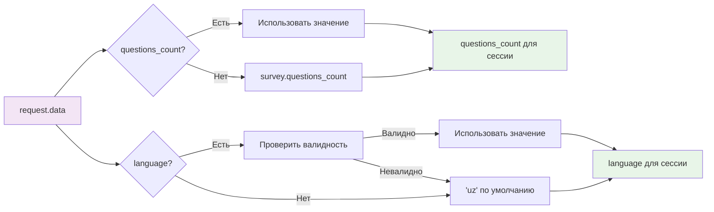
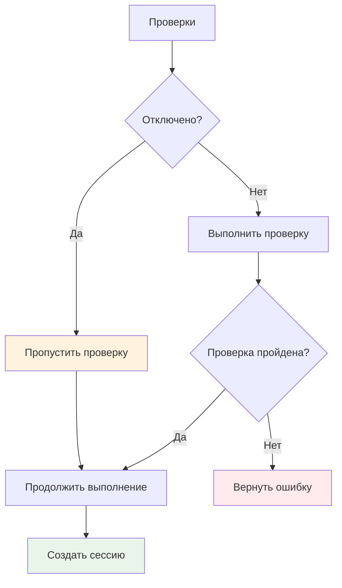

# Блок-схема: Запуск опроса (временно без проверок)

## 📊 Общая схема процесса

```mermaid
flowchart TD
    A[Фронтенд: POST /api/surveys/{id}/start/] --> B[Backend: Получение запроса]
    B --> C[Получение объекта Survey по ID]
    C --> D{Survey существует?}
    
    D -->|Нет| E[Ошибка 404: Survey not found]
    D -->|Да| F[Получение параметров из request.data]
    
    F --> G[questions_count = request.data.questions_count || survey.questions_count]
    F --> H[language = request.data.language || 'uz']
    
    G --> I[Начало транзакции БД]
    H --> I
    
    I --> J[Поиск последней попытки пользователя]
    J --> K[Вычисление номера следующей попытки]
    
    K --> L[Создание новой сессии SurveySession]
    L --> M[Инициализация вопросов для сессии]
    
    M --> N[Обновление статуса сессии на 'in_progress']
    N --> O[Создание/обновление истории пользователя]
    
    O --> P[Завершение транзакции БД]
    P --> Q[Возврат данных сессии + статус 201]
    
    Q --> R[Фронтенд: Получение ответа]
    
    style A fill:#e1f5fe
    style R fill:#e1f5fe
    style E fill:#ffebee
    style Q fill:#e8f5e8
```

## 🔄 Детальная схема создания сессии



## 📝 Схема обработки параметров



## ⚠️ Отключенные проверки (временно)



## 🚀 Последовательность действий фронтенда

### 1. Подготовка запроса
```javascript
const startSurvey = async (surveyId, options = {}) => {
  const response = await fetch(`/api/surveys/${surveyId}/start/`, {
    method: 'POST',
    headers: {
      'Authorization': `Bearer ${token}`,
      'Content-Type': 'application/json'
    },
    body: JSON.stringify({
      questions_count: options.questions_count, // опционально
      language: options.language || 'uz'        // опционально
    })
  });
  
  return response.json();
};
```

### 2. Обработка ответа
```javascript
try {
  const session = await startSurvey(1, {
    questions_count: 10,
    language: 'ru'
  });
  
  // session содержит:
  // - id: UUID сессии
  // - status: 'in_progress'
  // - current_question: первый вопрос
  // - progress: информация о прогрессе
  
  console.log('Сессия создана:', session);
} catch (error) {
  console.error('Ошибка создания сессии:', error);
}
```

## 📊 Структура ответа API

```json
{
  "id": "uuid-сессии",
  "survey": {
    "id": 1,
    "title": "Название опроса",
    "description": "Описание опроса"
  },
  "status": "in_progress",
  "attempt_number": 1,
  "started_at": "2024-01-01T12:00:00Z",
  "expires_at": "2024-01-01T12:45:00Z",
  "language": "ru",
  "progress": {
    "current": 0,
    "total": 10,
    "percentage": 0
  },
  "current_question": {
    "id": 1,
    "text": "Текст вопроса",
    "choices": [...]
  }
}
```

## 🔍 Возможные сценарии использования

### Сценарий 1: Запуск с параметрами по умолчанию
```javascript
// Запуск опроса с настройками по умолчанию
const session = await startSurvey(1);
```

### Сценарий 2: Запуск с кастомными параметрами
```javascript
// Запуск с 5 вопросами на русском языке
const session = await startSurvey(1, {
  questions_count: 5,
  language: 'ru'
});
```

### Сценарий 3: Множественные запуски (временно разрешено)
```javascript
// Можно запускать несколько раз подряд
const session1 = await startSurvey(1);
const session2 = await startSurvey(1); // Временно разрешено
const session3 = await startSurvey(1); // Временно разрешено
```

## 📋 Чек-лист для тестирования

- [ ] Запуск опроса без параметров
- [ ] Запуск с указанием количества вопросов
- [ ] Запуск с указанием языка
- [ ] Запуск с невалидными параметрами (должно работать)
- [ ] Множественные запуски одного опроса
- [ ] Проверка структуры ответа
- [ ] Проверка статуса сессии
- [ ] Проверка инициализации вопросов

## ⚡ Преимущества временного отключения проверок

1. **Быстрое прототипирование** - нет необходимости обходить ограничения
2. **Тестирование edge cases** - можно проверить поведение с любыми параметрами
3. **Упрощение разработки** - фокус на основной функциональности
4. **Отладка** - легче найти проблемы в логике фронтенда

## 🔄 План восстановления проверок

После завершения разработки фронтенда:

1. **Восстановить валидацию параметров**
2. **Включить проверку максимальных попыток**
3. **Включить проверку активных сессий**
4. **Добавить обработку ошибок валидации**
5. **Протестировать с включенными ограничениями**
